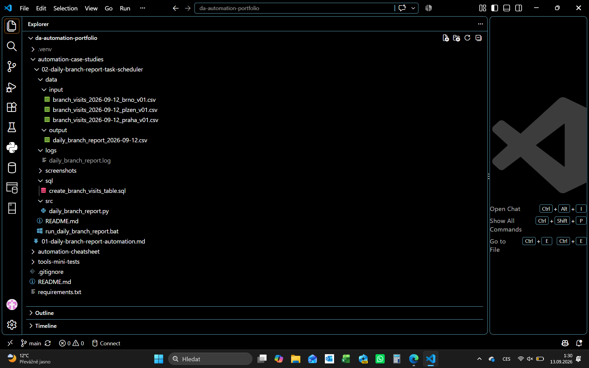
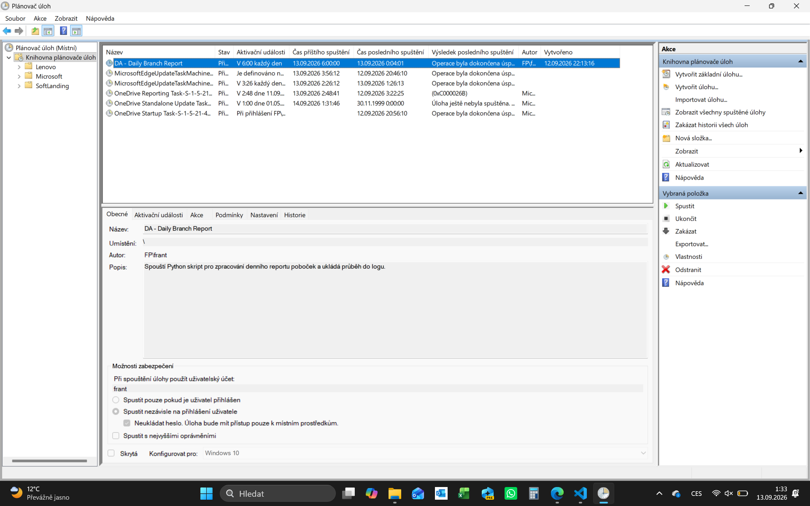
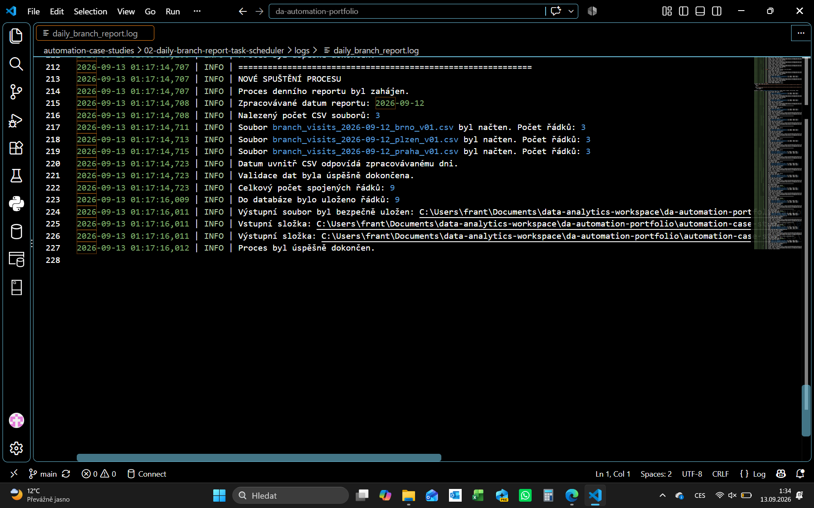
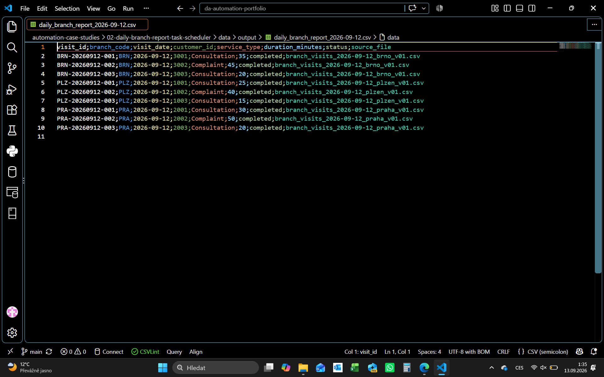
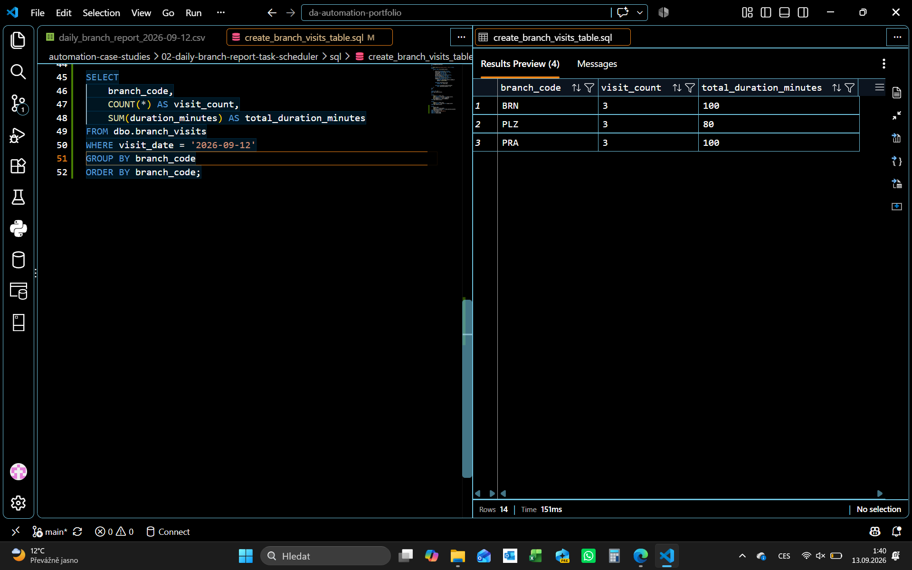

# Case Study 02 — Daily Branch Report with Windows Task Scheduler

Praktická implementace lokální automatizace denního reportu návštěvnosti poboček pomocí Pythonu, SQL Server LocalDB, BAT souboru a Windows Task Scheduleru.

Projekt navazuje na koncepční návrh [Case Study 01 — Daily Branch Report Automation](../01-daily-branch-report-automation.md). Zatímco první případová studie popisuje cílový proces a business pravidla, tato část realizuje jeho základní funkční variantu na jednom počítači.

---

## Cíl projektu

Cílem bylo převést ruční zpracování denních CSV souborů do opakovatelného procesu, který:

- se automaticky spouští každý den;
- vybere soubory za předchozí den;
- ověří strukturu a základní kvalitu dat;
- spojí data ze všech dostupných vstupních souborů;
- vytvoří výsledný CSV report;
- uloží stejná data do SQL databáze;
- při opakovaném spuštění nevytvoří duplicity;
- zaznamená průběh a chyby do logu;
- předá Plánovači úloh návratový kód procesu.

---

## Struktura projektu

```text
02-daily-branch-report-task-scheduler/
├── data/
│   ├── input/
│   │   ├── branch_visits_2026-09-12_brno_v01.csv
│   │   ├── branch_visits_2026-09-12_plzen_v01.csv
│   │   └── branch_visits_2026-09-12_praha_v01.csv
│   └── output/
│       └── daily_branch_report_2026-09-12.csv
├── logs/
│   └── daily_branch_report.log
├── screenshots/
├── sql/
│   └── create_branch_visits_table.sql
├── src/
│   └── daily_branch_report.py
├── README.md
└── run_daily_branch_report.bat
```



---

## Business scénář

Tři pobočky — Brno, Plzeň a Praha — ukládají každý den samostatný CSV soubor s údaji o návštěvách zákazníků. Management potřebuje jeden společný dataset připravený pro další reporting a kontrolu v databázi.

Ruční proces by vyžadoval každodenní otevření souborů, kontrolu jejich obsahu, spojení dat a vytvoření nového výstupu. Automatizace tyto opakující se kroky provádí bez ručního zásahu.

---

## Použité technologie

- Python - řízení procesu, načtení, validace, spojení a uložení dat;
- pandas - práce s tabulkovými daty a export CSV;
- pyodbc - připojení Pythonu k SQL Serveru;
- MS SQL Server 2022 LocalDB - lokální uložení výsledných dat;
- MS ODBC Driver 18 - komunikační vrstva mezi Pythonem a SQL Serverem;
- BAT - spuštění správného Python interpreteru a předání návratového kódu;
- Windows Task Scheduler - každodenní časové spuštění procesu;
- logging - záznam průběhu, výsledků a chyb.

---

## Architektura řešení

```text
Windows Task Scheduler
        ↓
run_daily_branch_report.bat
        ↓
daily_branch_report.py
        ↓
CSV vstupy → validace → spojení dat
        ↓
dočasný CSV soubor + databázová transakce
        ↓
výsledný CSV report + SQL tabulka + log
```

Windows Task Scheduler určuje čas spuštění. BAT soubor zavolá Python z virtuálního prostředí projektu. Python následně provede celý datový proces a vrátí informaci o úspěchu nebo selhání.

---

## Vstupní data

Skript očekává soubory s názvem:

```text
branch_visits_<YYYY-MM-DD>_<branch>_v<version>.csv
```

Příklad:

```text
branch_visits_2026-09-12_plzen_v01.csv
```

Skript při každém běhu automaticky určí předchozí kalendářní den a načte pouze soubory odpovídající tomuto datu.

---

## Průběh procesu

1. Určení data reportu jako předchozího kalendářního dne.
2. Vyhledání odpovídajících CSV souborů ve vstupní složce.
3. Načtení jednotlivých souborů a doplnění názvu zdrojového souboru.
4. Kontrola povinných sloupců.
5. Převod a validace datových typů.
6. Kontrola chybějících hodnot, záporné délky návštěvy a duplicitních `visit_id`.
7. Ověření, že datum uvnitř CSV odpovídá zpracovávanému dni.
8. Spojení validních dat do jednoho datasetu.
9. Vytvoření dočasného CSV souboru.
10. Uložení dat do SQL databáze v transakci.
11. Nahrazení výsledného CSV souboru až po úspěšném databázovém zápisu.
12. Zápis výsledku do logu a vrácení návratového kódu.

---

## Validace a reakce na chyby

- Nebyl nalezen žádný vstupní soubor - zapíše se `WARNING` a nový výstup se nevytvoří;
- Chybí povinný sloupec - proces skončí chybou;
- Datum nebo číslo nelze převést - proces skončí chybou;
- Povinná kontrolovaná hodnota chybí - proces skončí chybou;
- `duration_minutes` je záporné - proces skončí chybou;
- `visit_id` je duplicitní - proces skončí chybou;
- Datum uvnitř CSV neodpovídá dni reportu - proces skončí chybou;
- Selže databázový zápis - provede se `ROLLBACK` a proces skončí chybou;
- Všechny kroky proběhnou správně - proces skončí návratovým kódem `0`.

Kritické chyby zachytí hlavní blok `try/except`. Podrobná informace se uloží do logu a Python vrátí nenulový návratový kód.

---

## Idempotence a bezpečné ukládání

Databázový zápis probíhá v jedné transakci:

```text
odstranit řádky stejného data
→ vložit novou ověřenou verzi
→ COMMIT
```

Pokud zápis selže, provede se `ROLLBACK` a nepotvrzené databázové změny se zruší.

CSV výstup se nejprve vytvoří jako dočasný soubor s příponou `.tmp`. Oficiální CSV je nahrazeno až po úspěšném databázovém zápisu. Tím se snižuje riziko publikace neúplného souboru.

Databázová transakce a nahrazení souboru chrání každý cíl samostatně. Projekt nezajišťuje jednu společnou distribuovanou transakci přes databázi i souborový systém.

---

## Databázová vrstva

SQL skript vytvoří tabulku `dbo.branch_visits`, pokud ještě neexistuje.

Tabulka obsahuje:

- primární klíč nad `visit_id`;
- kontrolní omezení zakazující zápornou délku návštěvy;
- `source_file` pro dohledání původu záznamu;
- `loaded_at` s časem databázového načtení.

Připojení používá Windows Authentication prostřednictvím `Trusted_Connection`. Přihlašovací jméno ani heslo proto nejsou uloženy ve zdrojovém kódu.

---

## Automatické spuštění

Úloha `DA - Daily Branch Report` je ve Windows Task Scheduleru nastavena na každodenní spuštění v 06:00.

Plánovač spouští `cmd.exe`, který zavolá BAT soubor projektu. BAT soubor používá Python interpreter z `.venv` a předává jeho návratový kód zpět Plánovači.



---

## Logování

Každý běh je v logu oddělen záhlavím `NOVÉ SPUŠTĚNÍ PROCESU`.

Log obsahuje zejména:

- datum a čas běhu;
- zpracovávané datum reportu;
- počet nalezených souborů;
- názvy souborů a počty načtených řádků;
- výsledek validace;
- počet spojených a databázově uložených řádků;
- umístění výstupu;
- informaci o úspěchu nebo podrobnou chybu.



---

## Výsledky ověřovacího běhu

Testovací běh zpracoval tři vstupní soubory za datum `2026-09-12`.

| Výsledek | Hodnota |
|---|---:|
| Vstupní soubory | 3 |
| Zpracované pobočky | 3 |
| Spojené řádky | 9 |
| Řádky uložené do databáze | 9 |
| Návratový kód | 0 |

Výsledný CSV soubor obsahuje všech devět návštěv a sloupec `source_file`, který umožňuje dohledat původ každého řádku.



Kontrolní SQL agregace potvrdila tři návštěvy za každou pobočku:

| Pobočka | Počet návštěv | Celková délka v minutách |
|---|---:|---:|
| BRN | 3 | 100 |
| PLZ | 3 | 80 |
| PRA | 3 | 100 |



---

## Lokální spuštění

### Požadavky

- Windows;
- Python 3;
- SQL Server 2022 LocalDB;
- Microsoft ODBC Driver 18 for SQL Server.

### Instalace Python závislostí

Z kořenové složky repozitáře:

```powershell
py -m venv .venv
.\.venv\Scripts\Activate.ps1
python -m pip install -r requirements.txt
```

### Příprava databáze

1. V LocalDB vytvořit databázi `automation_practice`.
2. Spustit skript `sql/create_branch_visits_table.sql`.

### Nastavení BAT souboru

Soubor `run_daily_branch_report.bat` obsahuje cesty specifické pro lokální počítač. Před spuštěním je nutné je upravit podle umístění repozitáře.

### Ruční test

Z kořenové složky repozitáře:

```powershell
.\automation-case-studies\02-daily-branch-report-task-scheduler\run_daily_branch_report.bat
$LASTEXITCODE
```

Hodnota `0` potvrzuje úspěšné dokončení.

---

## Rozsah a omezení

Projekt představuje funkční lokální variantu automatizace. Oproti cílovému návrhu z Case Study 01 neobsahuje:

- událostní spuštění při doručení posledního souboru;
- výběr poslední validní verze pro každou pobočku;
- samostatnou kontrolu úplnosti očekávaných poboček;
- stav `WARNING` při chybějící jedné pobočce;
- toleranční okno pro opožděné vstupy do 07:00;
- archivaci předchozích výstupů;
- automatické upozornění při chybě;
- automatický refresh Power BI Service;
- centrální monitoring a správu přístupových údajů.

SQL Server LocalDB je vhodný pro výuku, vývoj a lokální portfolio projekt. Pro produkční firemní použití by bylo vhodné použít centrální databázi a řízené běhové prostředí.

---

## Možná další rozšíření

- kontrola očekávaného seznamu poboček;
- řízené zpracování opravených verzí souborů;
- upozornění při stavu `WARNING` nebo `FAILED`;
- samostatná tabulka s historií běhů;
- parametrizace databázového připojení;
- odstranění lokálních absolutních cest z BAT souboru;
- automatické testy validačních pravidel;
- napojení na Power BI Service.

---

## Související soubor

[Case Study 01 — Daily Branch Report Automation](../01-daily-branch-report-automation.md) — koncepční návrh cílového automatizovaného procesu.