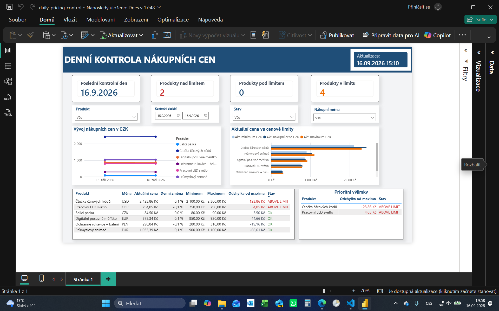
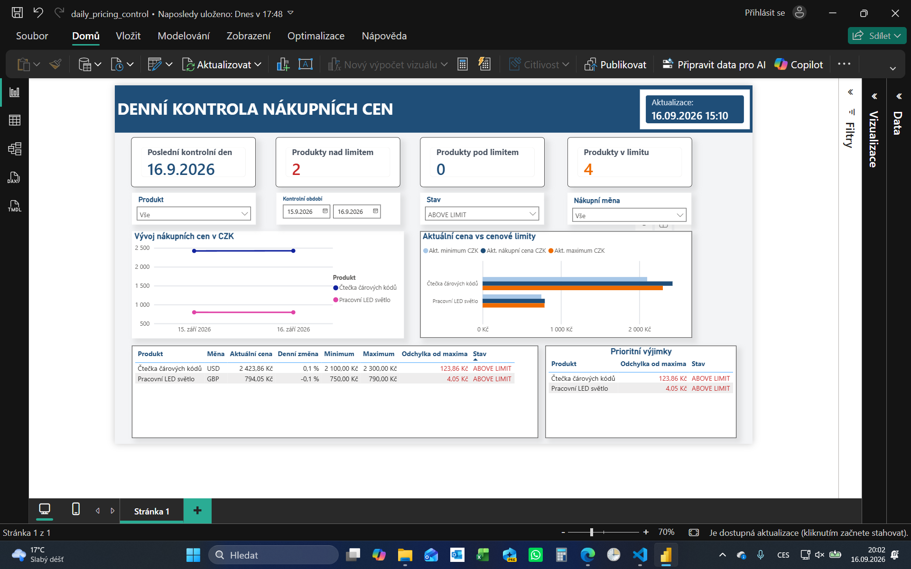
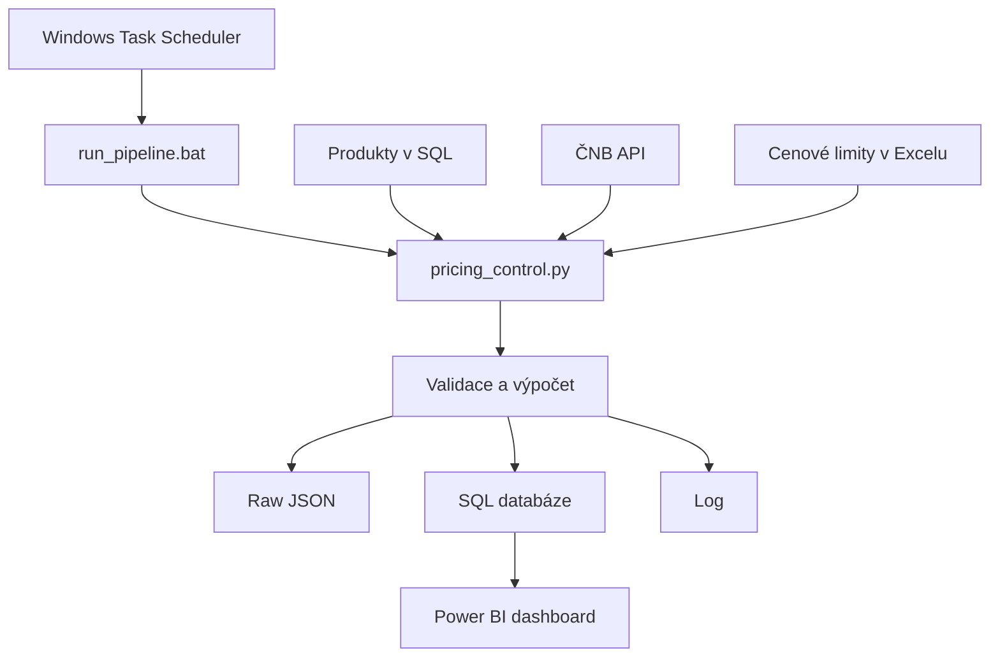
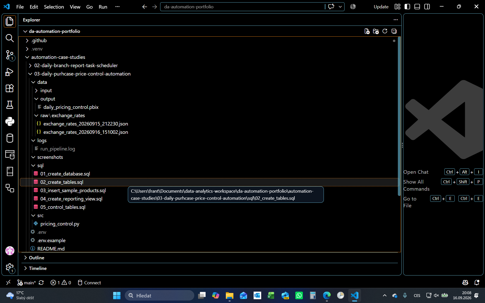
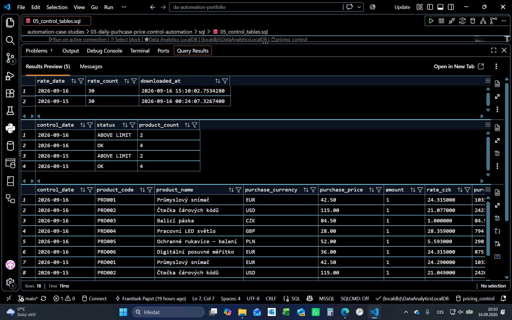
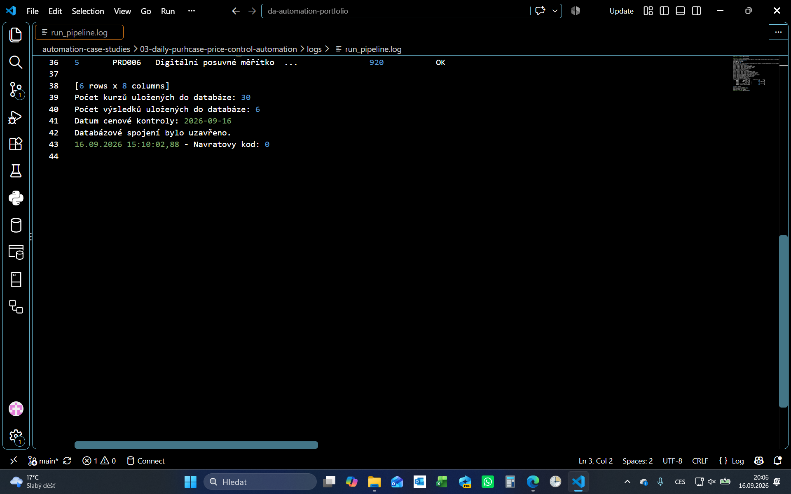

# Case Study 03 — Daily Purchase Price Control Automation

Komplexní end-to-end portfolio projekt automatizované denní kontroly nákupních cen pomocí Pythonu, API České národní banky, SQL Server LocalDB, Windows Task Scheduleru a Power BI.

Řešení každý pracovní den načte aktuální měnové kurzy, přepočítá nákupní ceny šesti produktů do CZK, porovná je s cenovými limity, uloží výsledky do databáze a zpřístupní je v manažerském dashboardu.

---

## Cíl projektu

Cílem bylo vytvořit opakovatelný proces, který:
- načte produkty a jejich nákupní ceny v různých měnách;
- získá aktuální kurzovní lístek z externího API;
- načte kontrolní minimum a maximum z Excelu;
- ověří strukturu, úplnost a základní business pravidla všech vstupů;
- přepočítá nákupní ceny do CZK;
- označí produkty pod limitem, v limitu nebo nad limitem;
- uloží původní API odpověď pro dohledatelnost;
- zapíše kurzy a výsledky kontroly do SQL databáze;
- při opakovaném spuštění stejného dne nevytvoří duplicity;
- zaznamená průběh a chyby do logu;
- spustí se automaticky prostřednictvím Windows Task Scheduleru;
- poskytne managementu přehled v Power BI.

---

## Business scénář

Firma nakupuje šest produktů v měnách CZK, EUR, USD, GBP a PLN. Nákupní ceny je potřeba každý pracovní den přepočítat do CZK podle aktuálního kurzovního lístku a porovnat s povoleným cenovým pásmem.

Management potřebuje rychle zjistit:
- které produkty překročily maximální cenu;
- které produkty klesly pod minimální cenu;
- jak se ceny změnily proti předchozímu dostupnému dni;
- jak se ceny vyvíjejí v čase;
- kdy byla data naposledy zpracována.

Dashboard nesčítá ceny různých produktů do jednoho nákladového KPI. Bez údajů o skutečně nakoupeném množství by takový součet neměl odpovídající business význam.

---

## Výsledek

Ověřovací běh pro datum `2026-09-16` úspěšně:
- načetl 6 produktů;
- získal 30 měnových kurzů;
- načetl 6 cenových limitů;
- uložil 30 kurzů do databáze;
- vytvořil a uložil 6 výsledků cenové kontroly;
- označil 2 produkty jako `ABOVE LIMIT`;
- označil 4 produkty jako `OK`;
- skončil návratovým kódem `0`.

Celková doba realizace projektu byla přibližně **15 hodin**.

---

## Power BI dashboard

Dashboard obsahuje:
- KPI pro poslední kontrolní den a počet produktů podle stavu;
- filtry podle produktu, období, stavu a nákupní měny;
- vývoj nákupních cen v CZK;
- porovnání aktuální ceny s minimálním a maximálním limitem;
- kontrolní tabulku všech produktů;
- samostatnou tabulku prioritních výjimek;
- datum a čas posledního zpracování dat.



### Pohled na prioritní výjimky

Filtr stavu umožňuje omezit dashboard pouze na produkty vyžadující pozornost.



Power BI Desktop používá importovaný datový model. Datová pipeline aktualizuje SQL databázi automaticky, ale lokální soubor `.pbix` je potřeba obnovit ručně prostřednictvím příkazu **Domů → Aktualizovat**. Automatický refresh Power BI Service není součástí této lokální varianty, protože vyžaduje vyšší licenci MS Office.

---

## Architektura řešení



Windows Task Scheduler určuje čas spuštění. BAT soubor zavolá Python interpreter z virtuálního prostředí. Python načte všechny zdroje, provede validaci, propojení a výpočty, archivuje původní odpověď API, uloží data do SQL a vrátí informaci o úspěchu nebo selhání.

---

## Použité technologie

- **Python** — řízení celé datové pipeline;
- **pandas** — načtení, čištění, validace, spojování a transformace dat;
- **requests** — komunikace s API České národní banky;
- **pyodbc** — připojení Pythonu k SQL Serveru;
- **python-dotenv** — načtení lokální konfigurace z `.env`;
- **Microsoft Excel** — vstupní tabulka cenových limitů;
- **SQL Server 2022 LocalDB** — lokální relační databáze;
- **Microsoft ODBC Driver 18** — komunikační vrstva mezi Pythonem a SQL Serverem;
- **Power BI Desktop** — datový model, DAX a manažerský dashboard;
- **BAT** — spuštění správného Python interpreteru a předání návratového kódu;
- **Windows Task Scheduler** — pravidelné časové spuštění;
- **logging** — záznam průběhu, výsledků a chyb.

---

## Struktura projektu

```text
03-daily-purchase-price-control-automation/
├── data/
│   ├── input/
│   │   └── price_limits.xlsx
│   ├── output/
│   │   └── daily_pricing_control.pbix
│   └── raw/
│       └── exchange_rates/
│           ├── exchange_rates_20260915_212230.json
│           └── exchange_rates_20260916_151002.json
├── logs/
│   └── run_pipeline.log
├── screenshots/
│   ├── 01_dashboard_overview.png
│   ├── 02_dashboard_exceptions.png
│   ├── 03_pipeline_success_log.png
│   ├── 04_sql_control_results.png
│   └── 05_project_structure.png
├── sql/
│   ├── 01_create_database.sql
│   ├── 02_create_tables.sql
│   ├── 03_insert_sample_products.sql
│   ├── 04_create_reporting_view.sql
│   └── 05_control_tables.sql
├── src/
│   └── pricing_control.py
├── .env.example
├── README.md
└── run_pipeline.bat
```

Soubor `.env` obsahuje lokální konfiguraci, není verzovaný a není součástí struktury publikované na GitHubu.



---

## Datové zdroje

### Produkty

Zdrojová tabulka produktů obsahuje zejména:
- identifikátor a kód produktu;
- název produktu;
- nákupní měnu;
- původní nákupní cenu.

### Kurzovní lístek

Aktuální kurzy jsou načítány z API České národní banky. Původní JSON odpověď se při každém úspěšném načtení uloží do:

```text
data/raw/exchange_rates/
```

Časové razítko v názvu souboru umožňuje dohledat konkrétní běh pipeline.

### Cenové limity

Soubor `data/input/price_limits.xlsx` obsahuje minimální a maximální povolenou cenu v CZK pro každý produkt.

---

## Business pravidla

Cena produktu v CZK se vypočítá podle množství měnových jednotek uvedeného v kurzovním lístku:

```text
nákupní cena v CZK = nákupní cena / množství měny × kurz CZK
```

Pro CZK je použit kurz `1`.

Výsledný stav produktu:

```text
cena < minimum  → BELOW LIMIT
minimum ≤ cena ≤ maximum → OK
cena > maximum  → ABOVE LIMIT
```

Každý produkt smí mít pro jeden kontrolní den pouze jeden výsledný záznam.

---

## Průběh pipeline

1. Načtení lokální konfigurace z `.env`.
2. Připojení k SQL Server LocalDB.
3. Načtení produktů z databáze.
4. Stažení kurzovního lístku z API.
5. Uložení původní API odpovědi do JSON.
6. Načtení cenových limitů z Excelu.
7. Kontrola struktury všech vstupních zdrojů.
8. Čištění dat a převod datových typů.
9. Kontrola povinných hodnot a duplicit.
10. Kontrola business pravidel cenových limitů.
11. Propojení produktů, kurzů a cenových limitů.
12. Výpočet nákupních cen v CZK.
13. Určení stavu `BELOW LIMIT`, `OK` nebo `ABOVE LIMIT`.
14. Finální validace propojeného datasetu.
15. Uložení kurzů a výsledků do SQL databáze.
16. Uzavření databázového spojení.
17. Zápis výsledku do logu a vrácení návratového kódu.

---

## Validace a reakce na chyby

Pipeline kontroluje zejména:
- dostupnost všech vstupních zdrojů;
- HTTP stav odpovědi API;
- přítomnost povinných sloupců;
- převod datových typů;
- chybějící povinné hodnoty;
- duplicity identifikátorů a kódů produktů;
- duplicity měnových kurzů;
- duplicity cenových limitů;
- platnost minimálních a maximálních cen;
- úplnost propojení produktů, kurzů a limitů;
- jedinečnost výsledku pro produkt a kontrolní den.

Pokud kritická validace selže, proces:
1. zapíše podrobnou chybu do logu;
2. ukončí databázové zpracování;
3. vrátí nenulový návratový kód BAT souboru a Task Scheduleru.

Úspěšný proces končí návratovým kódem `0`.

---

## Idempotence

Pipeline je navržena tak, aby opakované spuštění pro stejný kontrolní den nevytvořilo duplicitní výsledky.

```text
existující záznamy stejného data
→ bezpečná aktualizace dat pro daný den
→ jeden výsledek pro produkt a kontrolní den
```

Toto chování je důležité například při ručním opakování neúspěšného nebo přerušeného běhu.

---

## Databázová vrstva

SQL část projektu je rozdělena do pěti samostatných skriptů:

- `01_create_database.sql` - vytvoření databáze `pricing_control`;
- `02_create_tables.sql` - vytvoření databázových tabulek a omezení;
- `03_insert_sample_products.sql` - vložení šesti ukázkových produktů;
- `04_create_reporting_view.sql` - vytvoření reportingového pohledu pro Power BI;
- `05_control_tables.sql` - kontrola počtů, stavů, duplicit a výsledných dat.

Power BI načítá připravená data z reportingového pohledu. Databázová vrstva tak odděluje operativní tabulky od reportovacího rozhraní.



---

## Logování a monitoring

Soubor `logs/run_pipeline.log` obsahuje zejména:
- datum a čas zahájení procesu;
- použitou databázi;
- počet načtených produktů, kurzů a limitů;
- HTTP stav API;
- cestu k uložené raw odpovědi;
- výsledky jednotlivých validačních kroků;
- počet kurzů a výsledků uložených do databáze;
- datum cenové kontroly;
- návratový kód procesu.



---

## Automatické spuštění

Úloha `Daily Pricing Control` je ve Windows Task Scheduleru nastavena na každodenní spuštění v `15:00`, tedy po zveřejnění aktuálního kurzovního lístku ČNB.

Nastavení úlohy:
- akce spouští `run_pipeline.bat`;
- úlohu lze spustit také ručně;
- po zmeškaném termínu se spustí co nejdříve;
- při již běžícím procesu se nespustí další instance;
- počítač může být kvůli úloze probuzen;
- úspěšné dokončení vrací výsledek `0x0`.

BAT soubor nastaví pracovní složku projektu, spustí správný Python interpreter a předá jeho návratový kód zpět Plánovači úloh.

---

## Rozsah a omezení

Projekt představuje funkční lokální end-to-end variantu automatizace. Aktuální omezení:
- obsahuje pouze šest ukázkových produktů;
- historická data zatím pokrývají krátké období;
- cenové limity nemají evidovanou časovou platnost;
- zdroj neobsahuje skutečně nakoupené množství;
- finanční dopad odchylky proto nelze vypočítat;
- databáze SQL Server LocalDB je dostupná pouze lokálně;
- Power BI Desktop proto vyžaduje ruční obnovení importovaných dat;
- projekt neposílá automatické upozornění při překročení limitu nebo chybě;
- monitoring je založený na lokálním logu a návratovém kódu.

Pro firemní použití by bylo vhodné použít centrální databázi, řízené běhové prostředí a automatizovaný refresh reportingu.

---

## Možná další rozšíření

- jednorázový historický backfill kurzů a cenových kontrol;
- následné inkrementální načítání pouze nového pracovního dne;
- historie časové platnosti cenových limitů;
- doplnění skutečně nakoupeného množství a finančního dopadu;
- evidence dodavatele, smlouvy a objednávky;
- automatické upozornění při stavu `ABOVE LIMIT`, `BELOW LIMIT` nebo `FAILED`;
- samostatná tabulka s historií běhů pipeline;
- automatizované testy validačních a business pravidel;
- centrální SQL Server nebo cloudová databáze;
- publikace do Power BI Service a automatický refresh dat.

---

## Co projekt demonstruje

Projekt propojuje celý analytický proces od business požadavku po reporting:
```text
business problém
→ více datových zdrojů
→ API a archivace raw dat
→ validace a transformace v Pythonu
→ SQL databáze a reportingový pohled
→ automatické spuštění a logování
→ DAX a manažerský Power BI dashboard
```

Největší přínos projektu není v objemu dat, ale v implementaci kompletního, opakovatelného a kontrolovatelného procesu.